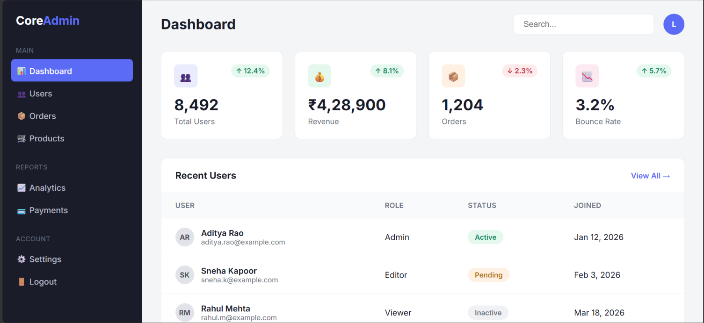

# Admin Dashboard

A clean and responsive admin dashboard UI built using HTML and CSS as a frontend learning project.

## 📌 About the Project

This project was created to practice building a structured and responsive dashboard interface using HTML5 and CSS3.

The dashboard displays common admin-panel elements such as statistics cards, navigation sections, a search bar, and a recent users table.

## ✨ Features

* Responsive admin dashboard layout
* Sidebar navigation
* Dashboard statistics cards
* Search input
* Recent users table
* User roles and status badges
* Responsive design for different screen sizes
* Hover and focus effects
* Clean and organized UI

## 🛠️ Technologies Used

* HTML5
* CSS3
* Google Fonts (Inter)

## 📂 Project Structure

```text
admin-dashboard/
│
├── index.html
├── styles.css
├── README.md
└── screenshots/
    └── dashboard.png
```

## 🚀 How to Run

1. Clone this repository:

```bash
git clone https://github.com/Lokeswari684/admin-dashboard.git
```

2. Open the project folder.

3. Open `index.html` in a web browser.

No additional installation or dependencies are required.

## 🎯 Learning Outcomes

Through this project, I practiced:

* Structuring web pages using HTML
* Creating layouts using CSS Grid and Flexbox
* Designing reusable UI sections
* Working with tables and navigation elements
* Using CSS pseudo-classes such as `:hover` and `:focus`
* Creating responsive layouts using media queries
* Improving spacing, typography, and visual hierarchy

## 📸 Project Preview



## 👩‍💻 Author

**Lokeswari Gonugunta**

GitHub: [Lokeswari684](https://github.com/Lokeswari684)
